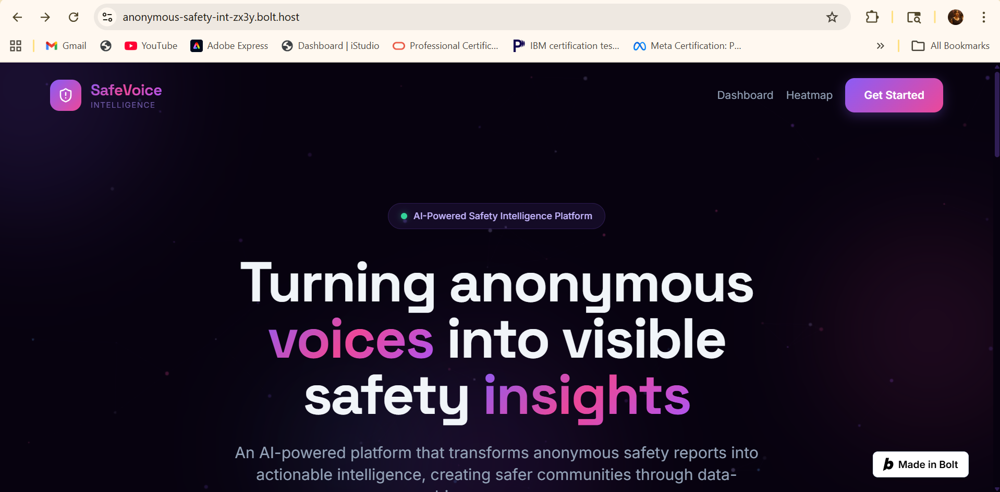
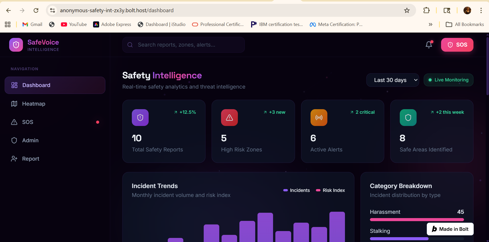
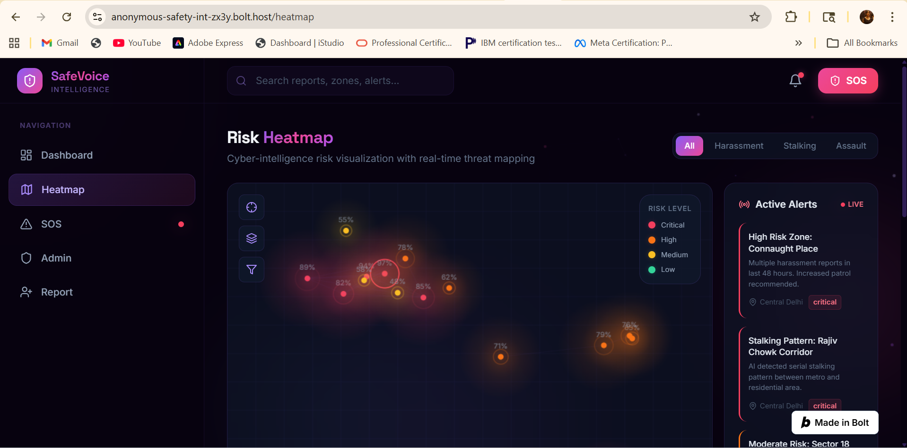
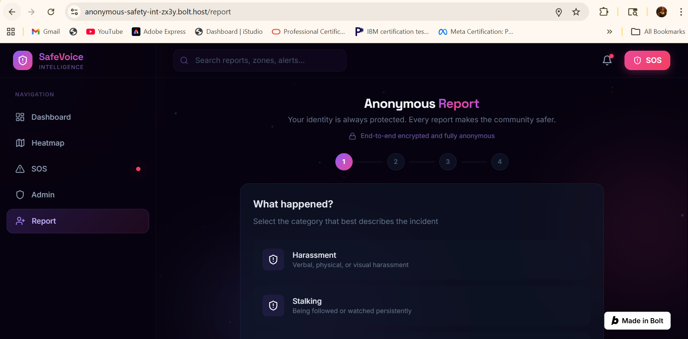
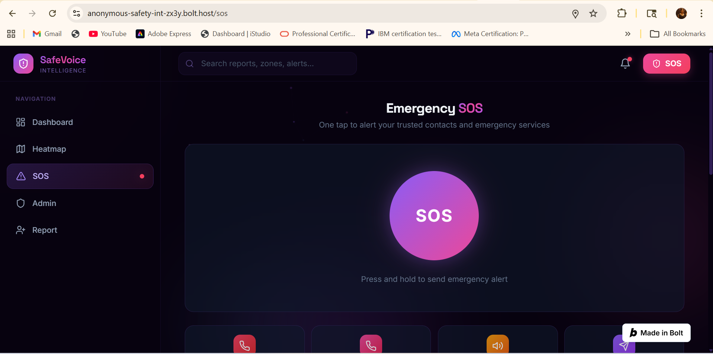

# SafeVoice — Anonymous Safety Intelligence System

A production-style AI-powered women safety platform that transforms anonymous incident reports into actionable safety intelligence through interactive heatmaps, AI-generated insights, and emergency assistance tools.

🌐 Live Demo

Try the deployed application:

https://anonymous-safety-int-zx3y.bolt.host

Explore the platform, submit anonymous reports, view AI safety analytics, and monitor high-risk zones in real time.

---

# 🚀 Key Features

* Anonymous incident reporting system
* AI-generated safety insights and trend analysis
* Interactive live safety heatmaps
* Emergency SOS support interface
* Admin moderation dashboard
* Real-time analytics and risk monitoring
* Responsive futuristic UI with glassmorphism design
* Community-driven safety intelligence

---

# 🧠 Problem Statement

Many unsafe incidents involving women remain unreported due to:

* fear of judgment
* lack of anonymity
* absence of trusted reporting systems
* low awareness of unsafe zones

Traditional reporting systems are often reactive, fragmented, and inaccessible.

As a result, dangerous patterns remain hidden and communities lack actionable safety intelligence.

---

# ⚙️ Solution Overview

SafeVoice provides a privacy-first platform where users can anonymously report unsafe incidents and transform isolated reports into meaningful community safety insights.

The platform combines:

* anonymous reporting
* AI-generated analytics
* live heatmaps
* emergency support systems

to help users make safer decisions and improve public awareness.

---

# 🔄 Workflow

1. User submits an anonymous safety report
2. Incident details are processed and categorized
3. Reports are stored and visualized on live heatmaps
4. AI-generated summaries identify patterns and risk spikes
5. Dashboards display trends and analytics
6. Admin panel moderates and monitors reports
7. Users gain awareness of unsafe zones and safer areas

---

# 💡 What Makes This Different

Unlike traditional reporting platforms:

* Reports are fully anonymous
* Heatmaps visualize community safety trends in real time
* AI insights identify risk patterns automatically
* Designed specifically for women-focused safety awareness
* Combines social impact with modern AI-powered analytics
* Focuses on prevention and awareness, not just reporting

---

# 🏗️ Architecture

Frontend (React + Vite)
↓
Tailwind CSS + Framer Motion UI
↓
Shared Incident Store
↓
AI Insight Generation Layer
↓
Leaflet + OpenStreetMap Heatmaps
↓
Admin Analytics Dashboard

---

# 🖥️ Application Modules

## Landing Page

* Hero section
* Feature highlights
* Animated statistics
* Testimonials
* How-it-works flow

## Anonymous Reporting System

* Incident submission form
* Severity indicators
* Geolocation support
* Anonymous reporting flow

## AI Insights Dashboard

* Safety trend analysis
* Risk analytics
* AI-generated recommendations
* Charts and incident statistics

## Live Heatmap

* High-risk zone visualization
* Severity-based markers
* Interactive map exploration

## SOS Emergency System

* Emergency SOS trigger
* Trusted contacts
* Quick safety support

## Admin Dashboard

* Report moderation
* Analytics monitoring
* Risk tracking
* Incident management

---

# 🧰 Tech Stack

Frontend:

* React
* TypeScript
* Vite
* Tailwind CSS
* Framer Motion

Visualization:

* Recharts
* Leaflet
* OpenStreetMap

Backend / Data:

* Mock in-memory state management
* Supabase-ready architecture

Deployment:

* Bolt Hosting

---

# 🎨 UI / UX Design

The platform uses:

* dark futuristic design
* neon purple and pink gradients
* glassmorphism cards
* responsive layouts
* animated interactions
* modern dashboard aesthetics

The design focuses on creating a trustworthy and emotionally impactful user experience.

---
# 🖼️ Screenshots

## Landing Page


## AI Dashboard


## Safety Heatmap


## Incident Reporting


## SOS Emergency


---

# 🧪 Features Demonstrated

* Anonymous report submission
* Dynamic dashboard updates
* Interactive heatmaps
* AI-generated incident summaries
* Responsive mobile-friendly interface
* Admin moderation workflow

---

# ⚠️ Limitations

* Current version uses mock/sample analytics data
* AI summaries are lightweight prototype implementations
* No persistent authentication system yet
* No real-time notification infrastructure
* Safe route optimization is prototype-level

---

# 🔮 Future Scope

* Real-time predictive safety alerts
* Verified authority integration
* Community validation system
* Advanced AI risk prediction
* Live notification infrastructure
* Safe route optimization
* Multi-language accessibility
* Mobile application support

---

# 📂 Project Structure

```bash
src/
├── components/
├── pages/
├── store/
├── data/
├── styles/
├── App.tsx
└── main.tsx

public/

supabase/
├── migrations/

README.md
```

---

# 📌 Example Use Case

## Scenario

A user anonymously reports repeated harassment incidents near a metro station during late evening hours.

## Platform Response

* Incident is added to the system
* Heatmap updates with a new risk marker
* Dashboard analytics reflect increased activity
* AI insights identify the area as a potential hotspot
* Community awareness improves through visible safety intelligence

---

# 🚀 Deployment

The application is deployed using Bolt Hosting:

https://anonymous-safety-int-zx3y.bolt.host

---

# ❤️ Mission

SafeVoice aims to empower safer communities by making anonymous voices visible through intelligent safety technology.

Designed to encourage reporting, improve awareness, and support women-focused community safety initiatives.
